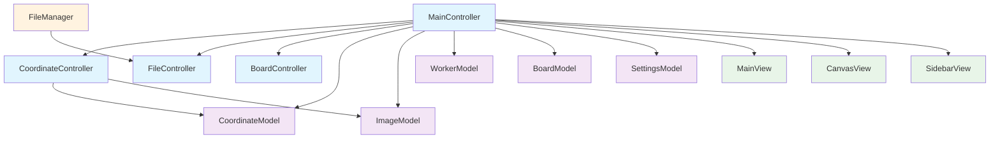

# Image Coords App クラスドキュメント インデックス

## 概要

このディレクトリには、Image Coords Appプロジェクトの主要なクラスのドキュメントが含まれています。各クラスの詳細な機能、メソッド、使用例を確認できます。

## アーキテクチャ

本プロジェクトは**MVC（Model-View-Controller）パターン**を採用しており、以下の構成になっています：

```text
┌─────────────────┐
│      Views      │  ← ユーザーインターフェース
├─────────────────┤
│   Controllers   │  ← ビジネスロジック・制御
├─────────────────┤
│     Models      │  ← データ管理・永続化
└─────────────────┘
```

## ドキュメント一覧

### 🏗️ コアコントローラー

#### [MainController](./MainController_class_documentation.md)

- **役割**: アプリケーション全体の制御と連携管理
- **主要機能**:
  - アプリケーション初期化
  - モード管理（編集/閲覧）
  - イベントハンドリング
  - コントローラー間連携

### 📊 データモデル

#### [CoordinateModel](./CoordinateModel_class_documentation.md)

- **役割**: 座標データと詳細情報の管理
- **主要機能**:
  - 座標の追加・削除・更新
  - アンドゥ/リドゥ機能
  - 座標詳細情報管理
  - 現在選択座標の管理

#### [ImageModel](./ImageModel_class_documentation.md)

- **役割**: 画像データとリサイズロジックの管理
- **主要機能**:
  - 画像読み込み・リサイズ
  - 座標変換（表示⇔元画像）
  - ディレクトリスキャン
  - Tkinter統合

#### [WorkerModel](./WorkerModel_class_documentation.md)

- **役割**: 作業者情報の管理
- **主要機能**:
  - 作業者データのCRUD操作
  - CSV形式での永続化
  - 入力検証
  - 現在の作業者管理

### 🛠️ ユーティリティ

#### [FileManager](./FileManager_class_documentation.md)

- **役割**: ファイル管理とセキュリティ
- **主要機能**:
  - ファイル検索・操作
  - 履歴管理・復元
  - バックアップ機能
  - 権限チェック
  - 操作ログ記録

## クラス関係図



## 使用開始ガイド

### 1. 基本的な初期化順序

```python
# 1. モデルの初期化
coordinate_model = CoordinateModel()
image_model = ImageModel()
worker_model = WorkerModel()
settings_model = AppSettingsModel()
board_model = BoardModel()

# 2. ビューの初期化
root = tk.Tk()
main_view = MainView(root)
canvas_view = CoordinateCanvasView(main_view.canvas_frame)
sidebar_view = SidebarView(main_view.sidebar_frame)

# 3. コントローラーの初期化
coordinate_controller = CoordinateController(coordinate_model, image_model)
file_controller = FileController()
board_controller = BoardController(board_model)

# 4. メインコントローラーの初期化と実行
main_controller = MainController(
    coordinate_model, settings_model, worker_model, image_model, board_model,
    main_view, canvas_view, sidebar_view, dialogs,
    coordinate_controller, file_controller, board_controller
)

# 5. アプリケーション開始
main_controller.initialize_application()
root.mainloop()
```

### 2. 主要な操作フロー

#### 座標の追加

```python
# ユーザーがキャンバスをクリック
# ↓
# MainController.on_canvas_left_click()
# ↓
# CoordinateController.add_coordinate()
# ↓
# CoordinateModel.add_coordinate()
```

#### ファイルの保存

```python
# ユーザーが保存ボタンをクリック
# ↓
# MainController.save_coordinates()
# ↓
# FileController.save_json_data()
# ↓
# JSONファイルに保存
```

## 設計原則

### 1. 単一責任原則（SRP）

各クラスは明確に定義された単一の責任を持ちます：

- **Model**: データの管理と操作
- **View**: ユーザーインターフェースの表示
- **Controller**: ビジネスロジックと制御

### 2. 依存性の逆転（DIP）

- 高レベルモジュールは低レベルモジュールに依存しない
- 抽象に依存し、具象に依存しない
- TYPE_CHECKINGを使用した循環インポートの回避

### 3. 開放閉鎖原則（OCP）

- 拡張に対して開放的
- 修正に対して閉鎖的
- プロトコルとコールバックパターンの活用

## パフォーマンス考慮事項

### メモリ管理

- **ImageModel**: 大きな画像のメモリ使用量に注意
- **CoordinateModel**: アンドゥスタックのサイズ制限（50件）
- **FileManager**: 古いファイルの自動削除機能

### ファイルI/O

- **非同期処理**: 大きなファイル操作時の考慮
- **バッチ操作**: 複数ファイルの効率的な処理
- **キャッシュ**: 頻繁にアクセスするデータのキャッシュ

## セキュリティ

### 権限管理

- **FileManager**: 「検査担当者」権限チェック
- **ファイルロック**: 排他制御による安全性確保
- **操作ログ**: 全操作の監査証跡

### データ整合性

- **入力検証**: すべてのユーザー入力の検証
- **ファイル整合性**: ファイル操作時の整合性チェック
- **エラーハンドリング**: 適切なエラー処理と復旧

## トラブルシューティング

### よくある問題

1. **画像が表示されない**
   - `ImageModel.load_image()`のエラーログを確認
   - 対応画像形式かチェック（JPEG, PNG, BMP, GIF, TIFF）

2. **座標が保存されない**
   - `CoordinateModel.coordinates`が空でないか確認
   - ファイル書き込み権限を確認

3. **作業者情報が読み込まれない**
   - `worker.csv`ファイルの存在確認
   - UTF-8エンコーディングの確認

## 開発者向け情報

### デバッグモード

```python
# デバッグモードの有効化
main_controller.set_debug_mode(True)

# または環境変数で設定
export DEBUG=1
```

### ログ出力

各クラスで`print()`文によるデバッグ情報が出力されます。本格的なロギングシステムの導入も検討してください。

### 型チェック

```bash
# mypyによる型チェック
mypy src/

# pylintによるコード品質チェック
pylint src/
```

## 今後の拡張予定

- [ ] **非同期処理**: 大きなファイル操作の非同期化
- [ ] **プラグインシステム**: 機能拡張のためのプラグイン機構
- [ ] **データベース統合**: SQLiteまたはPostgreSQLとの統合
- [ ] **ネットワーク機能**: リモートサーバーとの連携
- [ ] **テストカバレッジ**: ユニットテストの拡充

## 関連ドキュメント

- [API Reference](../README.md)
- [User Manual](../USER_MANUAL.md)
- [Development Guide](../DEVELOPMENT.md)
- [Deployment Guide](../DEPLOYMENT.md)

---

**最終更新**: 2025年8月18日  
**バージョン**: 1.0.0  
**作成者**: GitHub Copilot
