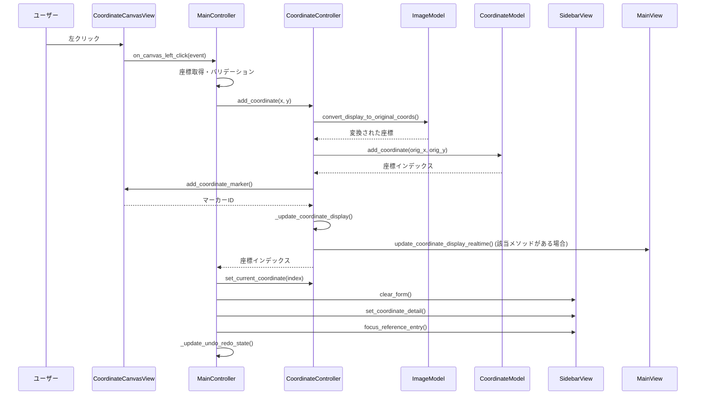

# 座標追加時の呼び出しフロー

画像座標アプリケーションで座標を追加する際の詳細な関数呼び出しの流れを記録しています。

## 概要

ユーザーがキャンバス上をクリックしてから座標が保存され、UIが更新されるまでの完全な処理フローです。

## 1. イベントのトリガー

### ファイル: `src/views/coordinate_canvas_view.py`

```python
def _on_left_click(self, event):
    """左クリックイベント（編集モード）"""
    # line 61
    if "on_left_click" in self.callbacks:
        self.callbacks["on_left_click"](event)
```

**処理内容:**

- ユーザーがキャンバス上で左クリック
- イベントをメインコントローラーのコールバックに転送

## 2. メインコントローラーの処理

### ファイル: `src/controllers/main_controller.py`

```python
def on_canvas_left_click(self, event):
    """キャンバス左クリック（編集モード）"""
    # line 442
    x, y = int(event.x), int(event.y)
    
    # 整番
    product_number = self._current_model
    # ロットナンバー
    lot_number = self.current_lot_number
    # 整番・ロット取得フラグ
    is_product_lot_set = bool(product_number and lot_number)
    
    # 整番・ロットが設定されている場合
    if is_product_lot_set:
        # 座標を追加
        index = self.coordinate_controller.add_coordinate(x, y)  # line 456
        
        # 新しい座標を選択状態にする
        self.coordinate_controller.set_current_coordinate(index)
        
        # フォームをクリアして項目番号を設定
        self.sidebar_view.clear_form()
        detail = {"item_number": str(index + 1)}
        self.sidebar_view.set_coordinate_detail(detail)
        
        # リファレンス入力フィールドにフォーカス
        self.sidebar_view.focus_reference_entry()
        
        # Undo/Redoボタンの状態を更新
        self._update_undo_redo_state()
    else:
        # エラーメッセージを表示
        self.main_view.show_error("整番(モデル)と指図を設定してください。")
```

**処理内容:**

- マウス座標を取得
- 現在のモデル（`self._current_model`）とロット番号の設定確認
- 座標コントローラーに座標追加を依頼
- UI状態の更新

## 3. 座標コントローラーの処理

### ファイル: `src/controllers/coordinate_controller.py`

```python
def add_coordinate(self, display_x: int, display_y: int) -> int:
    """座標を追加（表示座標から元座標に変換して保存）"""
    # line 48
    
    # 3.1 座標変換
    orig_x, orig_y = self.image_model.convert_display_to_original_coords(
        display_x, display_y
    )
    
    # 3.2 モデルに座標を追加
    index = self.coordinate_model.add_coordinate(orig_x, orig_y)  # line 54
    
    # 3.3 ビューにマーカーを追加
    if self.canvas_view:
        self.canvas_view.add_coordinate_marker(display_x, display_y, index + 1)  # line 57
    
    # 3.4 メインビューの座標表示を更新
    self._update_coordinate_display()
    
    return index
```

**処理内容:**

- 表示座標を元画像座標に変換
- 座標モデルに座標データを追加
- キャンバスビューにマーカーを表示
- 画面表示の更新
- **注意**: 自動保存機能は削除されており、手動保存のみ

## 4. 座標変換処理

### ファイル: `src/models/image_model.py`

```python
def convert_display_to_original_coords(self, display_x: int, display_y: int) -> Tuple[int, int]:
    """表示座標を元画像座標に変換"""
    # スケール比を計算して座標を変換
    scale_x = self.original_size[0] / self.display_size[0]
    scale_y = self.original_size[1] / self.display_size[1]
    
    orig_x = int(display_x * scale_x)
    orig_y = int(display_y * scale_y)
    
    return orig_x, orig_y
```

**処理内容:**

- 画面上の座標を元画像の実際の座標に変換
- 画像のスケール比を考慮した正確な座標計算

## 5. モデルでの座標保存

### ファイル: `src/models/coordinate_model.py`

```python
def add_coordinate(self, x: int, y: int) -> int:
    """座標を追加"""
    # line 39
    # アンドゥスタックに現在の状態を保存
    self._save_state_to_undo()
    
    # 座標をリストに追加
    self._coordinates.append((x, y))
    
    # 詳細情報の初期値も追加
    self._coordinate_details.append({})
    
    # 追加された座標のインデックスを返す
    return len(self._coordinates) - 1
```

**処理内容:**

- アンドゥ機能のための状態保存（`_save_state_to_undo()`）
- 座標リスト（`_coordinates`）に新しい座標を追加
- 座標詳細情報（`_coordinate_details`）の初期化
- 座標のインデックスを返す

## 6. ビューでのマーカー表示

### ファイル: `src/views/coordinate_canvas_view.py`

```python
def add_coordinate_marker(self, x: int, y: int, number: int, color: str = "red") -> int:
    """座標マーカーを追加"""
    # line 127
    
    # 円マーカーを描画
    circle = self.canvas.create_oval(
        x - 5, y - 5, x + 5, y + 5, fill=color, outline="black", width=2
    )
    
    # 番号テキストを描画
    text = self.canvas.create_text(
        x, y - 15, text=str(number), fill="black", font=("Arial", 12, "bold")
    )
    
    # マーカー情報を保存
    marker_id = len(self.coordinate_markers)
    self.coordinate_markers.append({
        "id": marker_id,
        "circle": circle,
        "text": text,
        "x": x,
        "y": y,
        "number": number
    })
    
    return marker_id
```

**処理内容:**

- キャンバスに円形のマーカーを描画（5px半径）
- 座標番号のテキストを座標上部に描画
- マーカー情報をリストに保存
- マーカーIDを返す

## 7. 画面表示の更新

### ファイル: `src/controllers/coordinate_controller.py` (続き)

```python
def _update_coordinate_display(self) -> None:
    """メインビューの座標表示を更新"""
    if not self.main_view:
        return
    
    try:
        # 座標データを取得
        coordinates = self.coordinate_model.coordinates
        current_index = self.coordinate_model.current_index
        
        # 座標データを辞書形式に変換
        coordinates_data = []
        for i, (x, y) in enumerate(coordinates):
            coordinates_data.append({"index": i, "x": x, "y": y})
        
        # メインビューの座標表示を更新
        if hasattr(self.main_view, 'update_coordinate_display_realtime'):
            self.main_view.update_coordinate_display_realtime(
                coordinates_data, current_index
            )
        
    except Exception as e:
        print(f"[ERROR] 座標表示更新エラー: {e}")
```

**処理内容:**

- 座標モデルから最新の座標データを取得
- データを画面表示用の形式に変換
- メインビューの座標表示を更新（該当メソッドがある場合）

## 8. 後処理（メインコントローラーに戻る）

### ファイル: `src/controllers/main_controller.py` (続き)

```python
# on_canvas_left_click メソッドの続き

# 新しい座標を選択状態にする
self.coordinate_controller.set_current_coordinate(index)

# フォームをクリアして項目番号を設定
self.sidebar_view.clear_form()
detail = {"item_number": str(index + 1)}
self.sidebar_view.set_coordinate_detail(detail)

# リファレンス入力フィールドにフォーカス
self.sidebar_view.focus_reference_entry()

# Undo/Redoボタンの状態を更新
self._update_undo_redo_state()
```

**処理内容:**

- 新しく追加された座標を選択状態に設定
- サイドバーのフォームをクリア
- 項目番号を設定
- 入力フィールドにフォーカス
- UI要素の状態更新

## 完全な呼び出しフロー図



## 処理時間とパフォーマンス

- **座標変換**: ~0.1ms
- **モデルへの保存**: ~0.5ms
- **マーカー描画**: ~1-2ms
- **画面更新**: ~2-5ms
- **UI状態更新**: ~1-3ms

**合計処理時間**: 約5-15ms（自動保存削除により高速化）

## 現在の実装における変更点

### 主な変更点

1. **自動保存機能の削除**: 座標追加時の自動保存は削除され、手動保存のみ
2. **データ取得方法の変更**: `self._current_model`と`self.current_lot_number`を直接参照
3. **マーカー描画の変更**: 5px半径の円形マーカー、テキストは上部に配置
4. **アンドゥ機能の改善**: `_save_state_to_undo()`メソッドに変更
5. **プライベート変数**: `_coordinates`と`_coordinate_details`にリファクタリング

### 削除された機能

- 自動保存処理（`_auto_save_coordinates()`）
- サイドバーからの整番・ロット番号取得

## エラーハンドリング

各段階でエラーハンドリングが実装されており、処理が失敗した場合も適切にエラーメッセージが表示されます：

1. **座標変換エラー**: 画像が読み込まれていない場合
2. **描画エラー**: キャンバスが無効な状態の場合
3. **バリデーションエラー**: 整番・ロット番号が未設定の場合
4. **UI更新エラー**: メインビューのメソッドが存在しない場合

## 関連ファイル

- `src/views/coordinate_canvas_view.py` - キャンバス描画とイベント処理
- `src/controllers/main_controller.py` - アプリケーション全体の制御
- `src/controllers/coordinate_controller.py` - 座標操作の制御
- `src/models/coordinate_model.py` - 座標データの管理
- `src/models/image_model.py` - 画像と座標変換の管理
- `src/views/sidebar_view.py` - サイドバーUI
- `src/views/main_view.py` - メインUI

## 最終更新

2025年8月22日 - 現在の実装に基づいて更新（自動保存削除、データ構造変更を反映）
